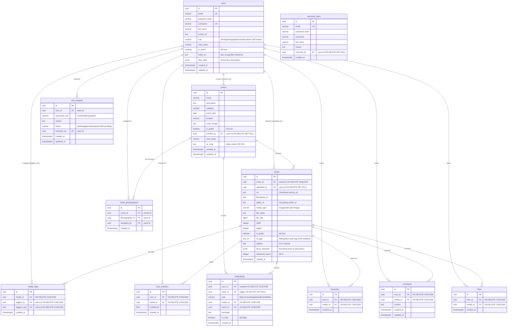
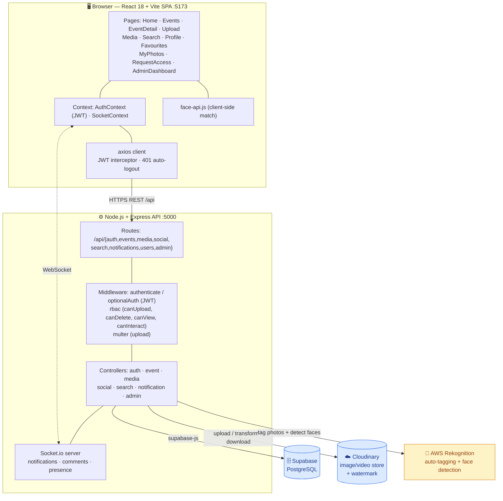

# CIG Platform — Data Schema & Architecture

This doc explains how my project is put together — the database tables and how
the different parts talk to each other. Basically it's an event/media app for
photography clubs: photographers upload event photos, members browse them and
can like/comment/tag/favourite, the AI auto-tags photos, and face recognition
lets you find "photos of me". Admins handle events, users and roles.

**Stack I used:** React 18 + Vite (frontend), Node.js + Express (backend),
PostgreSQL through Supabase, Cloudinary for storing the media, Socket.io for
real-time, JWT for auth, and AWS Rekognition for both the AI tagging and the
face recognition.

---

## 1. The Database (ER diagram)



### Unique constraints
These stop duplicate rows from being created:

| Table | Unique key | Why |
|---|---|---|
| `users` | `email`, `username` | one account per email / username |
| `likes` | `(user_id, media_id)` | you can only like a photo once |
| `favourites` | `(user_id, media_id)` | one favourite per user per photo |
| `media_tags` | `(media_id, tagged_user)` | tag someone once per photo |
| `face_matches` | `(user_id, media_id)` | one match row per user per photo |
| `event_photographers` | `(event_id, photographer_id)` | assign a photographer once |
| `removed_users` | `email` | look up a tombstone when someone tries to log in again |

### Indexes
I added these so the common queries don't get slow:
`idx_media_event_id`, `idx_media_uploaded_by`, `idx_media_ai_tags` (GIN on `ai_tags`),
`idx_likes_media_id`, `idx_comments_media_id`, `idx_notifications_user (user_id, is_read)`,
`idx_face_matches_user`, `idx_events_date (event_date DESC)`, `idx_removed_users_email`.

### Views
- **`media_with_counts`** — the `media` table plus the uploader's name/avatar,
  the event name, and the `like_count`, `comment_count` and `favourite_count`
  all added up. This is what the gallery uses.
- **`events_with_counts`** — the `events` table plus the creator's username and
  a `media_count`.

> **Note to self:** `users`, `events`, `media`, `likes`, `comments`,
> `media_tags`, `favourites`, `notifications`, `face_matches` are all in
> [backend/src/config/schema.sql](backend/src/config/schema.sql), and
> `removed_users` is in
> [migrations/002_removed_users.sql](backend/src/config/migrations/002_removed_users.sql).
> But `role_requests` and `event_photographers` are used by the code and don't
> have a SQL file committed yet — they only exist in Supabase right now. I should
> add a migration for them so the schema is fully reproducible.

---

## 2. How the system fits together



### A couple of example flows
**Uploading a photo** → `POST /api/media/upload` → `authenticate` + the RBAC
`canUploadToEvent` check → multer holds the files → Cloudinary upload (chunked
if it's over 9 MB) → Rekognition does the auto-tags and face detection → rows
get written to `media` (and `face_matches`) → Socket.io sends a
`notification:new` to everyone subscribed to that event.

**"My photos"** → `POST /api/media/selfie` saves the `selfie_url`/`face_data` →
`GET /api/media/my-photos` compares the user's face data against
`media.faces_detected` (on the client with face-api.js) and the `face_matches`
rows.

**Downloading** → `GET /api/media/:id/download` → Cloudinary stamps a watermark
(club + event + role) on the image and bumps the `download_count`.

---

## 3. Roles & permissions

| Role | What they can do |
|---|---|
| **admin** | Everything — create/edit/delete events, manage users, assign photographers, review role requests, see stats |
| **photographer** | Upload media to the events they're **assigned** to, and delete their own uploads |
| **member** | Like, comment, favourite, and tag users |
| **viewer** | Read-only — can send a `role_request` to get upgraded |

Auth is stateless **JWT** (sent in the Bearer header, `JWT_EXPIRES_IN` is `7d` by
default). The frontend keeps `token` and `user` in `localStorage`, axios adds the
token to requests, and it auto-logs-out on a 401. The RBAC helper functions in
[rbac.middleware.js](backend/src/middleware/rbac.middleware.js) handle the
per-event upload check, the per-media delete check, viewing private events, and
whether viewers can interact.

---

## 4. The API (quick summary)

| Group | Main endpoints |
|---|---|
| **auth** `/api/auth` | `POST /register` · `POST /login` · `GET/PUT /profile` · `PUT /change-password` |
| **events** `/api/events` | `GET /` · `POST /` (admin) · `GET/PUT/DELETE /:id` (admin for writes) · `GET /:id/media` |
| **media** `/api/media` | `POST /upload` (photographer/admin) · `GET /my-photos` · `POST /selfie` · `GET /:id` · `DELETE /:id` · `GET /:id/download` |
| **social** `/api/social` | `POST /like` · `POST /comment` · `DELETE /comment/:id` · `POST /favourite` · `GET /favourites` · `POST /tag` · `DELETE /tag/:id` · `GET /share/:id` |
| **search** `/api/search` | `GET /` (q, type, tags, date range, paging) |
| **notifications** `/api/notifications` | `GET /` · `POST /mark-read` |
| **users** `/api/users` | `GET /search` · `GET /:id` |
| **admin** `/api/admin` | `stats` · `requests` + `requests/:id/review` · user CRUD + `users/:id/role` · `assign-photographer` / `remove-photographer` · `event-photographers/:event_id` · public: `public-stats`, `request-role`, `my-request` |

---

## 5. Environment Variables

```
SUPABASE_URL · SUPABASE_ANON_KEY · SUPABASE_SERVICE_KEY
JWT_SECRET · JWT_EXPIRES_IN (7d)
CLOUDINARY_CLOUD_NAME · CLOUDINARY_API_KEY · CLOUDINARY_API_SECRET
AWS_REGION (us-east-1) · AWS_ACCESS_KEY_ID · AWS_SECRET_ACCESS_KEY
PORT (5000) · FRONTEND_URL (http://localhost:5173) · NODE_ENV
```

For the frontend there's also `VITE_API_URL` (it falls back to the `/api` dev proxy).
